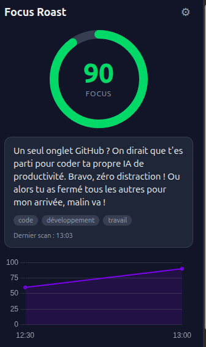

# Focus Roast 🔥

Chrome extension (Manifest V3) that scans your open tabs at regular intervals,
sends their **titles + domains** (never the full URLs) to **Gemini** (Google
API), and shows:

- a **focus score** (0-100) with a circular gauge and color code,
- a **roast**: a blunt and funny — but always good-natured — comment about what
  you are currently doing,
- a **chart** of your score evolution over the day.

Everything is **100% local**: no data is sent anywhere other than the Gemini
API, and your API key never leaves your browser (`chrome.storage.local`).

---

## Preview

<p align="center">
  
</p>

The popup shows the **focus score** (colored gauge), the current **roast** with
its categories, and the **chart** of the score evolution over the day.

---

## Tech stack

- **TypeScript** (`strict` mode, no `any`)
- **Manifest V3** for Chrome
- **Vite** + **@crxjs/vite-plugin** (MV3-aware hot-reload)
- **React 18** for the popup UI
- **Zod** to validate the LLM's structured response
- **Chart.js** + **react-chartjs-2** for the history chart
- **chrome.storage.local** for persistence (no backend)
- **chrome.alarms** for the periodic scan (survives service worker sleep, unlike
  `setInterval`)
- **Google Gemini API** (`gemini-2.5-flash`, structured JSON output via
  `responseSchema`) for scoring + roast, called from the service worker

### Architecture

```
src/
├─ background/
│  └─ service-worker.ts   # alarm, scan, AI orchestration, storage, manual scan
├─ lib/
│  ├─ tabAnalyzer.ts      # tab reading + cleaning + filtering
│  ├─ aiClient.ts         # Gemini API call + Zod JSON validation
│  ├─ focusScore.ts       # score smoothing (moving average) + chart buckets
│  └─ storage.ts          # typed access to chrome.storage.local (+ daily reset)
├─ popup/
│  ├─ index.html
│  ├─ main.tsx
│  ├─ Popup.tsx           # assembles the UI and reads storage
│  ├─ index.css
│  └─ components/
│     ├─ ScoreGauge.tsx   # circular SVG gauge
│     ├─ RoastDisplay.tsx # roast + categories + time
│     ├─ HistoryChart.tsx # score chart over the day
│     └─ ApiKeySetup.tsx  # API key entry / editing
└─ types/
   └─ index.ts            # shared types
```

---

## Installation (developer mode)

### 1. Prerequisites

- Node.js ≥ 18
- npm

### 2. Build the extension

```bash
npm install
npm run build
```

The **`dist/`** folder then contains the extension ready to be loaded.

> For development with hot-reload: `npm run dev` (then load the `dist/` folder as
> below; @crxjs reloads automatically on every change).

### 3. Load in Chrome

1. Open `chrome://extensions`.
2. Enable **Developer mode** (toggle in the top right).
3. Click **Load unpacked**.
4. Select the project's **`dist/`** folder.
5. The **Focus Roast** icon appears in the extensions bar (pin it for easy
   access).

---

## API key configuration

On first launch, the popup shows a setup screen.

1. Get an API key from
   [Google AI Studio](https://aistudio.google.com/app/apikey) (it starts with
   `AIza...`).
2. Paste it into the field and click **Save**.

The key is stored **only** in `chrome.storage.local` (on your machine). You can
change it at any time via the ⚙ icon in the popup.

---

## How it works

- An automatic scan runs **every 5 minutes** via `chrome.alarms`.
- Before each scan, internal tabs (`chrome://`, `about:blank`, extension
  pages…) are filtered out.
- Only **title + domain** are sent to the LLM (never the full URL with its
  parameters).
- The displayed score is **smoothed** (moving average over the latest scans) to
  avoid abrupt variations.
- History is kept for the **current day** and reset every day (at midnight,
  local time).
- You can force an immediate scan with the **Scan now** button.

### Requested permissions

| Permission | Why |
| ---------- | --- |
| `tabs` | Read tab titles and URLs to extract the domain. |
| `storage` | Persist the API key, the last result and the history. |
| `alarms` | Schedule the periodic scan reliably under MV3. |
| `host_permissions: https://generativelanguage.googleapis.com/*` | Call the Gemini API from the service worker. |

---

## Privacy

- No backend, no third-party server: the only network requests go to
  `generativelanguage.googleapis.com`.
- No full URL is transmitted — only titles and domains.
- The API key and history stay local and are never exported.

---

## Scripts

| Command | Effect |
| ------- | ------ |
| `npm run dev` | Build in watch mode (MV3 hot-reload). |
| `npm run build` | Typecheck (`tsc -b`) + production build into `dist/`. |
| `npm run typecheck` | Type checking only. |
